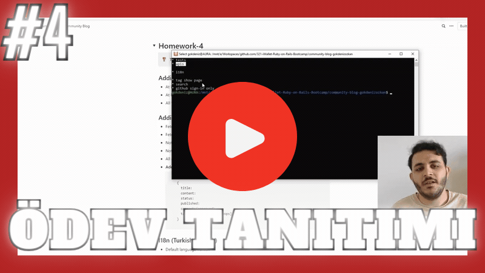
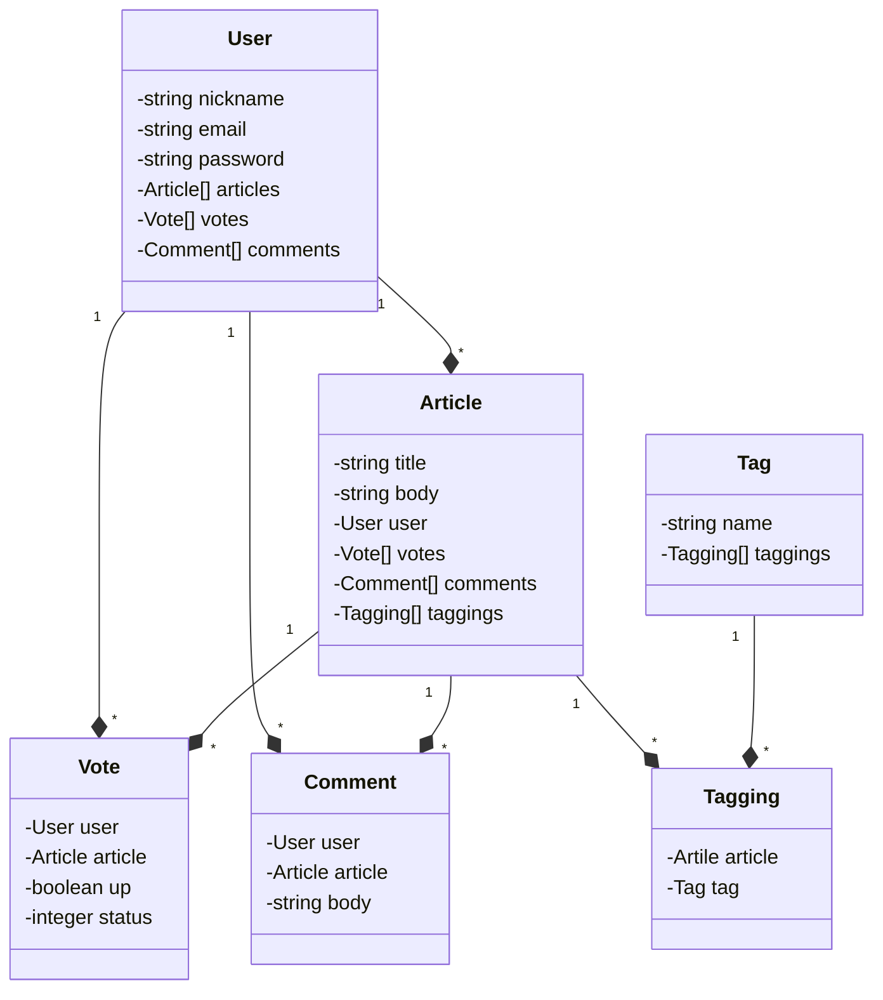
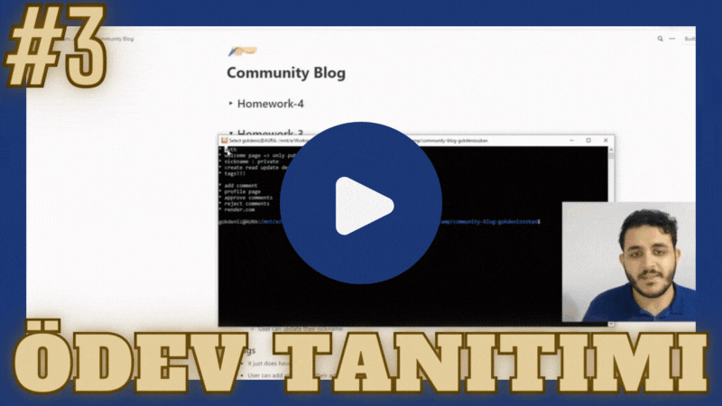

# Community Blog

A community blog to share highs and lows of your development journey. This project is developed for iWallet Ruby on Rails bootcamp capstone project.  
Live here at: https://community-blog.gokdenizozkan.com/  
  
<a href="https://youtu.be/62A_EPFW33k"></a>

^ A quick look to all criteria asked in Homework #4, watch here: [https://youtu.be/62A_EPFW33k](https://youtu.be/62A_EPFW33k)

## Features

v1.0.0
- Tests: 6 controller & 6 model tests.
- APIs: `/api/v1/articles` and `/api/v1/articles/1`
- Turkish localization, full coverage! (including local-time gem)
- Tags have their own page displaying related & published articles (it was there in v0.9.0)
- Search bar that is capable of looking up titles and tags.
- GitHub Sign In Only

v0.9.0
- User authentication & authorization
- Changeable nicknames
- Tags have articles, articles have tags!
- To comment or not to comment, that is the question.
- Press on the thumbs up button if you liked this video...
- We are alive! https://community-blog.gokdenizozkan.com/

v0.3.0
- Publish an article to make it accessable.
- Published articles cannot be modified nor de-published again.

v0.2.0
- Post an article.
- See articles of others.

## Getting Started

Make sure you have Ruby, Rails, and PostgreSQL installed on your machine. Then;

1. Clone this repository.
2. Get into the project directory.
3. Run the commands below, and you are ready to go:
```bash
bin/rails db:create db:migrate
bin/rails server
```

Disclaimer: If you have been using the previous version, `db:migrate` is sufficient to run the app.

When server starts, the blog will be available on http://127.0.0.1:3000/

## Versioning

SemVer is used for versioning on the `main` branch. For active development, see `dev` branch.

## UML Diagram



## 3rd Parties

Turkish Localization for Devise was taken from https://gist.github.com/cihad/1564962

## Old Visual Representations

3rd Homework:  
  
<a href="https://youtu.be/-Qccqw0K3Zw"></a>  
  
2nd Homework:  


  
1st Homework:  


