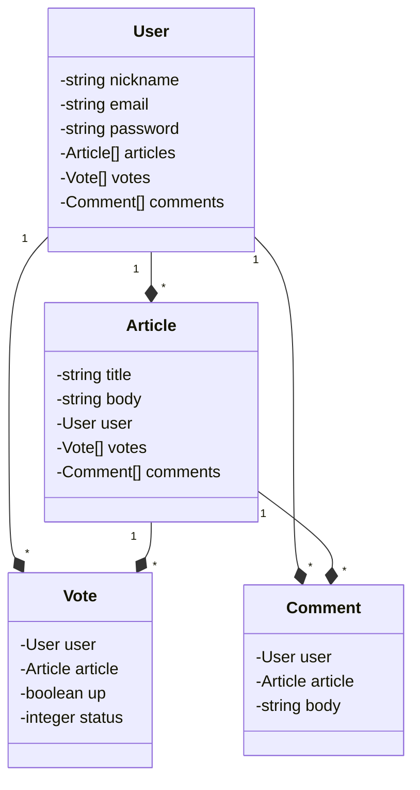

# Community Blog

A community blog to share highs and lows of your development journey. This project is developed for iWallet Ruby on Rails bootcamp capstone project.


^ A quick look to all criteria asked in Homework #2

## Features
v0.3.0
- Publish an article to make it accessable.
- Published articles cannot be modified nor de-published again.

v0.2.0
- Post an article.
- See articles of others.

## Getting Started

Make sure you have Ruby, Rails, and PostgreSQL installed on your machine. Then;

1. Clone this repository.
2. Get into the project directory.
3. Run the commands below, and you are ready to go:
```bash
bin/rails db:create db:migrate
bin/rails server
```

Disclaimer: If you have been using the previous version, `db:migrate` is sufficient to run the app.

When server starts, the blog will be available on http://127.0.0.1:3000/

## Versioning

SemVer is used for versioning on the `main` branch. For active development, see `dev` branch.

## UML Diagram

