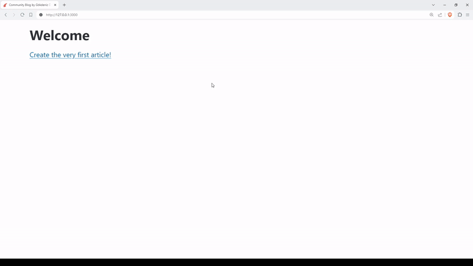

# Community Blog

A community blog to share highs and lows of your development journey. This project is developed for iWallet Ruby on Rails bootcamp capstone project.



## Features

- Post an article.
- See articles of others.

## Getting Started

Make sure you have Ruby and Rails installed on your machine. Then;

1. Clone this repository.
2. Get into the project directory.
3. Run the commands below, and you are ready to go:
```bash
bin/rails db:create db:migrate
bin/rails server
```

When server starts, the blog will be available on http://127.0.0.1:3000/

## Versioning

SemVer is used for versioning on the `main` branch. For active development, see `dev` branch.
